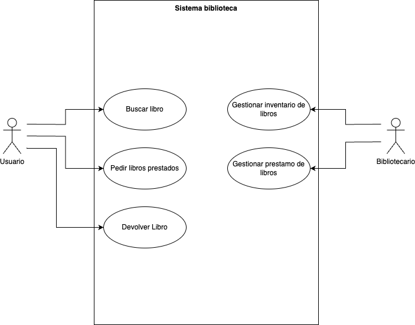

# Realiza-los-casos-de-uso-propuestos

# Especificación de Casos de Uso

## Caso de Uso 1: Buscar Libro
| **Atributo** | **Descripción** | **Tipo** |
|---|---|---|
| Nombre | Buscar Libro | Caso de uso |
| Descripción | El usuario busca un libro específico en el catálogo de la biblioteca. | Texto |
| Actores principales | Usuario | Actor |
| Precondiciones | El catálogo de la biblioteca debe estar disponible. | Condición |
| Flujo principal | 1. El usuario accede al sistema. 2. Introduce los datos del libro que busca. 3. El sistema muestra los resultados coincidentes. | Secuencia |
| Flujo alternativo | Si no se encuentran resultados, el sistema informa al usuario. | Secuencia |
| Postcondiciones | El usuario tiene información sobre la disponibilidad del libro. | Resultado |
| Autor | franciscorodalf | Texto |
| Fecha | 20/11/2024 | Fecha |

---

## Caso de Uso 2: Pedir Libros Prestados
| **Atributo** | **Descripción** | **Tipo** |
|---|---|---|
| Nombre | Pedir Libros Prestados | Caso de uso |
| Descripción | El usuario solicita el préstamo de uno o más libros. | Texto |
| Actores principales | Usuario | Actor |
| Precondiciones | El usuario debe estar registrado en el sistema. El libro solicitado debe estar disponible. | Condición |
| Flujo principal | 1. El usuario selecciona el libro que desea pedir prestado. 2. Confirma el préstamo. 3. El sistema actualiza el estado del libro como "prestado". | Secuencia |
| Flujo alternativo | Si el libro no está disponible, el sistema informa al usuario. | Secuencia |
| Postcondiciones | El libro queda registrado como prestado al usuario. | Resultado |
| Autor | franciscorodalf| Texto |
| Fecha | 20/11/2024 | Fecha |

---

## Caso de Uso 3: Devolver Libro
| **Atributo** | **Descripción** | **Tipo** |
|---|---|---|
| Nombre | Devolver Libro | Caso de uso |
| Descripción | El usuario devuelve un libro previamente prestado. | Texto |
| Actores principales | Usuario | Actor |
| Precondiciones | El libro debe haber sido prestado al usuario. | Condición |
| Flujo principal | 1. El usuario entrega el libro en el sistema. 2. El sistema actualiza el estado del libro como "disponible". | Secuencia |
| Postcondiciones | El libro está disponible nuevamente para otros usuarios. | Resultado |
| Autor | franciscorodalf | Texto |
| Fecha | 20/11/2024 | Fecha |

---

## Caso de Uso 4: Gestionar Inventario de Libros
| **Atributo** | **Descripción** | **Tipo** |
|---|---|---|
| Nombre | Gestionar Inventario de Libros | Caso de uso |
| Descripción | El bibliotecario administra el inventario de libros. | Texto |
| Actores principales | Bibliotecario | Actor |
| Precondiciones | El bibliotecario debe tener permisos de administrador en el sistema. | Condición |
| Flujo principal | 1. El bibliotecario accede al módulo de gestión de inventario. 2. Realiza las modificaciones necesarias (agregar, editar, eliminar libros). 3. El sistema guarda los cambios. | Secuencia |
| Postcondiciones | El catálogo refleja las modificaciones realizadas. | Resultado |
| Autor | franciscorodalf| Texto |
| Fecha | 20/11/2024 | Fecha |

---

## Caso de Uso 5: Gestionar Préstamo de Libros
| **Atributo** | **Descripción** | **Tipo** |
|---|---|---|
| Nombre | Gestionar Préstamo de Libros | Caso de uso |
| Descripción | El bibliotecario administra los préstamos de libros. | Texto |
| Actores principales | Bibliotecario | Actor |
| Precondiciones | El bibliotecario debe estar autenticado en el sistema. | Condición |
| Flujo principal | 1. El bibliotecario revisa las solicitudes de préstamo. 2. Confirma o rechaza las solicitudes según la disponibilidad. 3. Registra devoluciones y renueva préstamos según corresponda. | Secuencia |
| Postcondiciones | El sistema actualiza los estados de los préstamos y devoluciones. | Resultado |
| Autor | franciscorodalf | Texto |
| Fecha | 20/11/2024 | Fecha |

---

## Actores

### **Actor: Usuario**
| **Atributo** | **Descripción** |
|---|---|
| **Descripción** | Persona que utiliza el sistema para buscar libros, solicitar préstamos o devolverlos. |
| **Características** | Puede buscar libros y gestionar sus préstamos. |
| **Relaciones** | Ninguna. |
| **Referencias** | Buscar Libro, Pedir Libros Prestados, Devolver Libro |
| **Notas** | Ninguna. |
| **Autor** | franciscorodalf|
| **Fecha** | 20/11/2024 |

---

### **Actor: Bibliotecario**
| **Atributo** | **Descripción** |
|---|---|
| **Descripción** | Persona responsable de gestionar el inventario y los préstamos de libros. |
| **Características** | Tiene permisos administrativos en el sistema. |
| **Relaciones** | Ninguna. |
| **Referencias** | Gestionar Inventario de Libros, Gestionar Préstamo de Libros |
| **Notas** | Ninguna. |
| **Autor** | franciscorodalf |
| **Fecha** | 20/11/2024 |

#Ejercicio2 

# Especificación de Casos de Uso

## Caso de Uso 1: Buscar Producto
| **Atributo** | **Descripción** | **Tipo** |
|---|---|---|
| Nombre | Buscar Producto | Caso de uso |
| Descripción | El cliente busca un producto en el catálogo del sistema. | Texto |
| Actores principales | Cliente | Actor |
| Precondiciones | El sistema debe tener productos registrados en el catálogo. | Condición |
| Flujo principal | 1. El cliente accede al sistema. 2. Ingresa palabras clave en el buscador. 3. El sistema muestra los resultados correspondientes. | Secuencia |
| Flujo alternativo | Si no se encuentran productos, el sistema notifica al cliente. | Secuencia |
| Postcondiciones | El cliente visualiza los productos disponibles. | Resultado |
| Autor | franciscorodalf | Texto |
| Fecha | 20/11/2024 | Fecha |

---

## Caso de Uso 2: Añadir Productos al Carrito
| **Atributo** | **Descripción** | **Tipo** |
|---|---|---|
| Nombre | Añadir Productos al Carrito | Caso de uso |
| Descripción | El cliente selecciona productos y los añade al carrito de compras. | Texto |
| Actores principales | Cliente | Actor |
| Precondiciones | Debe haber productos disponibles en el catálogo. | Condición |
| Flujo principal | 1. El cliente selecciona un producto. 2. Elige la cantidad deseada. 3. Añade el producto al carrito. | Secuencia |
| Flujo alternativo | Si no hay suficiente inventario, el sistema notifica al cliente. | Secuencia |
| Postcondiciones | El producto queda registrado en el carrito de compras. | Resultado |
| Autor | franciscorodalf | Texto |
| Fecha | 20/11/2024 | Fecha |

---

## Caso de Uso 3: Realizar Pedido
| **Atributo** | **Descripción** | **Tipo** |
|---|---|---|
| Nombre | Realizar Pedido | Caso de uso |
| Descripción | El cliente confirma los productos seleccionados para realizar el pedido. | Texto |
| Actores principales | Cliente | Actor |
| Precondiciones | El carrito debe contener al menos un producto. | Condición |
| Flujo principal | 1. El cliente accede al carrito. 2. Revisa los productos seleccionados. 3. Confirma el pedido. | Secuencia |
| Flujo alternativo | Si no hay productos en el carrito, el sistema informa que no se puede realizar el pedido. | Secuencia |
| Postcondiciones | El pedido queda registrado en el sistema. | Resultado |
| Autor | franciscorodalf| Texto |
| Fecha | 20/11/2024 | Fecha |

---

## Caso de Uso 4: Realizar Pago
| **Atributo** | **Descripción** | **Tipo** |
|---|---|---|
| Nombre | Realizar Pago | Caso de uso |
| Descripción | El cliente realiza el pago de los productos seleccionados. | Texto |
| Actores principales | Cliente | Actor |
| Precondiciones | Debe existir un pedido registrado en el sistema. | Condición |
| Flujo principal | 1. El cliente selecciona el método de pago. 2. Ingresa los datos requeridos (por ejemplo, tarjeta de crédito). 3. Confirma el pago. 4. El sistema procesa la transacción. | Secuencia |
| Flujo alternativo | Si el pago es rechazado, el sistema informa al cliente para reintentar. | Secuencia |
| Postcondiciones | El pago queda registrado y el pedido se marca como pagado. | Resultado |
| Autor | franciscorodalf | Texto |
| Fecha | 20/11/2024 | Fecha |

---

## Caso de Uso 5: Gestionar Catálogo de Productos
| **Atributo** | **Descripción** | **Tipo** |
|---|---|---|
| Nombre | Gestionar Catálogo de Productos | Caso de uso |
| Descripción | El administrador agrega, edita o elimina productos del catálogo. | Texto |
| Actores principales | Administrador | Actor |
| Precondiciones | El administrador debe estar autenticado en el sistema. | Condición |
| Flujo principal | 1. El administrador accede al módulo de catálogo. 2. Selecciona la acción deseada (agregar, editar o eliminar). 3. Ingresa o modifica los datos del producto. 4. Confirma la operación. 5. El sistema guarda los cambios en el catálogo. | Secuencia |
| Flujo alternativo | Si los datos ingresados son incorrectos, el sistema solicita correcciones. | Secuencia |
| Postcondiciones | El catálogo se actualiza con los cambios realizados. | Resultado |
| Autor | franciscorodalf | Texto |
| Fecha | 20/11/2024 | Fecha |

---

## Actores

### **Actor: Cliente**
| **Atributo** | **Descripción** |
|---|---|
| Descripción | Persona que utiliza el sistema para buscar y adquirir productos. |
| Características | Puede buscar productos, añadirlos al carrito, realizar pedidos y realizar pagos. |
| Relaciones | Ninguna. |
| Referencias | Buscar Producto, Añadir Productos al Carrito, Realizar Pedido, Realizar Pago |
| Notas | Ninguna. |
| Autor | franciscorodalf |
| Fecha | 20/11/2024 |

---

### **Actor: Administrador**
| **Atributo** | **Descripción** |
|---|---|
| Descripción | Persona encargada de gestionar el catálogo de productos. |
| Características | Puede añadir, editar y eliminar productos en el sistema. |
| Relaciones | Ninguna. |
| Referencias | Gestionar Catálogo de Productos |
| Notas | Ninguna. |
| Autor |franciscorodalf |
| Fecha | 20/11/2024 |

#Ejercicio3

# Especificación de Casos de Uso

## Caso de Uso 1: Inscribirse en Curso
| **Atributo** | **Descripción** | **Tipo** |
|---|---|---|
| Nombre | Inscribirse en Curso | Caso de uso |
| Descripción | El estudiante selecciona un curso y se registra para participar en él. | Texto |
| Actores principales | Estudiante | Actor |
| Precondiciones | El curso debe estar disponible y el estudiante debe estar registrado en el sistema. | Condición |
| Flujo principal | 1. El estudiante accede al catálogo de cursos. 2. Selecciona un curso. 3. Confirma su inscripción. 4. El sistema registra al estudiante en el curso. | Secuencia |
| Flujo alternativo | Si el curso no tiene plazas disponibles, el sistema informa al estudiante. | Secuencia |
| Postcondiciones | El estudiante queda inscrito en el curso. | Resultado |
| Autor | franciscorodalf | Texto |
| Fecha | 20/11/2024 | Fecha |

---

## Caso de Uso 2: Ver Material del Curso
| **Atributo** | **Descripción** | **Tipo** |
|---|---|---|
| Nombre | Ver Material del Curso | Caso de uso |
| Descripción | El estudiante accede a los materiales disponibles del curso al que está inscrito. | Texto |
| Actores principales | Estudiante | Actor |
| Precondiciones | El estudiante debe estar inscrito en el curso. | Condición |
| Flujo principal | 1. El estudiante accede al curso. 2. Selecciona el material deseado. 3. Visualiza o descarga el contenido. | Secuencia |
| Flujo alternativo | Si el material no está disponible, el sistema informa al estudiante. | Secuencia |
| Postcondiciones | El estudiante accede al material seleccionado. | Resultado |
| Autor | franciscorodalf| Texto |
| Fecha | 20/11/2024 | Fecha |

---

## Caso de Uso 3: Realizar Evaluaciones
| **Atributo** | **Descripción** | **Tipo** |
|---|---|---|
| Nombre | Realizar Evaluaciones | Caso de uso |
| Descripción | El estudiante responde las evaluaciones del curso. | Texto |
| Actores principales | Estudiante | Actor |
| Precondiciones | Debe haber evaluaciones disponibles en el curso. | Condición |
| Flujo principal | 1. El estudiante accede a la evaluación. 2. Responde las preguntas o actividades. 3. Envía las respuestas al sistema. | Secuencia |
| Flujo alternativo | Si la evaluación ya fue completada, el sistema informa que no es posible volver a realizarla. | Secuencia |
| Postcondiciones | La evaluación queda registrada como completada para el estudiante. | Resultado |
| Autor | franciscorodalf | Texto |
| Fecha | 20/11/2024 | Fecha |

---

## Caso de Uso 4: Crear Curso
| **Atributo** | **Descripción** | **Tipo** |
|---|---|---|
| Nombre | Crear Curso | Caso de uso |
| Descripción | El administrador crea un nuevo curso en el sistema. | Texto |
| Actores principales | Administrador | Actor |
| Precondiciones | El administrador debe estar autenticado en el sistema. | Condición |
| Flujo principal | 1. El administrador accede al módulo de creación de cursos. 2. Ingresa los datos del curso (nombre, descripción, materiales, etc.). 3. Confirma la creación del curso. 4. El sistema guarda el curso en el catálogo. | Secuencia |
| Flujo alternativo | Si faltan datos requeridos, el sistema solicita completar la información. | Secuencia |
| Postcondiciones | El curso queda disponible en el catálogo. | Resultado |
| Autor | franciscorodalf| Texto |
| Fecha | 20/11/2024 | Fecha |

---

## Caso de Uso 5: Calificar Evaluaciones
| **Atributo** | **Descripción** | **Tipo** |
|---|---|---|
| Nombre | Calificar Evaluaciones | Caso de uso |
| Descripción | El administrador revisa y califica las evaluaciones realizadas por los estudiantes. | Texto |
| Actores principales | Administrador | Actor |
| Precondiciones | Deben existir evaluaciones enviadas por los estudiantes. | Condición |
| Flujo principal | 1. El administrador accede al módulo de evaluaciones. 2. Selecciona una evaluación enviada. 3. Revisa las respuestas y asigna una calificación. 4. El sistema registra la calificación. | Secuencia |
| Flujo alternativo | Si la evaluación ya fue calificada, el sistema lo notifica. | Secuencia |
| Postcondiciones | La calificación queda registrada y visible para el estudiante. | Resultado |
| Autor | franciscorodalf| Texto |
| Fecha | 20/11/2024 | Fecha |

---

## Caso de Uso 6: Actualizar Contenidos del Curso
| **Atributo** | **Descripción** | **Tipo** |
|---|---|---|
| Nombre | Actualizar Contenidos del Curso | Caso de uso |
| Descripción | El administrador edita los materiales y contenidos de un curso existente. | Texto |
| Actores principales | Administrador | Actor |
| Precondiciones | El curso debe estar registrado en el sistema. | Condición |
| Flujo principal | 1. El administrador selecciona el curso a editar. 2. Realiza cambios en los contenidos o materiales. 3. Confirma la actualización. 4. El sistema guarda los cambios. | Secuencia |
| Flujo alternativo | Si el curso no existe, el sistema notifica al administrador. | Secuencia |
| Postcondiciones | El curso se actualiza con los nuevos contenidos. | Resultado |
| Autor |franciscorodalf| Texto |
| Fecha | 20/11/2024 | Fecha |

---

## Actores

### **Actor: Estudiante**
| **Atributo** | **Descripción** |
|---|---|
| Descripción | Persona que participa en los cursos como aprendiz. |
| Características | Puede inscribirse en cursos, ver materiales y realizar evaluaciones. |
| Relaciones | Ninguna. |
| Referencias | Inscribirse en Curso, Ver Material del Curso, Realizar Evaluaciones |
| Notas | Ninguna. |
| Autor | franciscorodalf |
| Fecha | 20/11/2024 |

---

### **Actor: Administrador**
| **Atributo** | **Descripción** |
|---|---|
| Descripción | Persona encargada de gestionar cursos y calificaciones. |
| Características | Puede crear y actualizar cursos, así como calificar evaluaciones. |
| Relaciones | Ninguna. |
| Referencias | Crear Curso, Calificar Evaluaciones, Actualizar Contenidos del Curso |
| Notas | Ninguna. |
| Autor | franciscorodalf|
| Fecha | 20/11/2024 |
